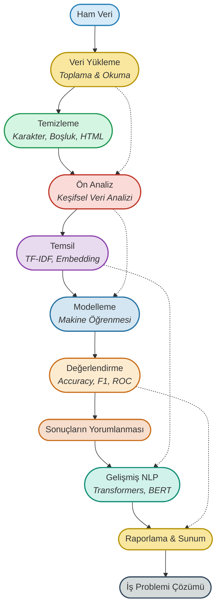

## 🚦 NLP Vaka Çalışması Yolculuğu

<p align="center">
  <b>Gerçek e-ticaret ve spam veri setleriyle metin sınıflandırma, temsili ve analizine giden profesyonel yolculuk!</b>
</p>



---

## 📊 Proje Özeti

Bu klasörde, **e-ticaret ve spam veri setleri** üzerinde metin sınıflandırma ve temsili için modern NLP teknikleri uygulanmaktadır. 
Çalışmalar, gerçek veriyle, endüstri standardı Python kütüphaneleri (pandas, scikit-learn, transformers, vb.) ve güncel makine öğrenmesi yaklaşımlarıyla yapılmıştır.

### Ana Adımlar:
- Veri setlerinin yüklenmesi ve incelenmesi
- Temizleme ve ön analiz
- TF-IDF ve embedding ile metin temsili
- Makine öğrenmesi ile sınıflandırma
- Sonuçların değerlendirilmesi ve yorumlanması
- Gelişmiş NLP: Transformer tabanlı modeller

---

## 🌟 Vaka Çalışması Aşamaları & Flashcardlar

### 1. **Veri Yükleme (Toplama & Okuma)**
- **Amaç:** Ham e-ticaret ve spam verilerini uygun formata getirmek.
- <div style="border:1px solid #2980B9; border-radius:8px; padding:12px; background:#F4F8FB; margin:10px 0;">
  <b>Soru:</b> Veri yükleme neden kritik bir adımdır ve sürecin başarısına nasıl etki eder?<br>
  <b>Cevap:</b> Ham verinin doğru ve eksiksiz toplanması, sonraki tüm işlemlerin sağlıklı ilerlemesi için gereklidir.
  </div>

---

### 2. **Temizleme (Cleaning)**
- **Aşamalar:**  
  - Özel karakter, sayı, HTML etiketi, gereksiz boşluk temizliği
- **Kod:**
  ```python
  import re
  metin = "<p>Ücretsiz kargo! 2025 fırsatları...</p>"
  temiz = re.sub(r'<.*?>', '', metin)  # HTML etiketlerini kaldır
  temiz = re.sub(r'[^a-zA-ZçğıöşüÇĞİÖŞÜ\s]', '', temiz)  # özel karakterleri kaldır
  temiz = temiz.strip()
  print(temiz)
  # çıktı: Ücretsiz kargo fırsatları
  ```
- <div style="border:1px solid #229954; border-radius:8px; padding:12px; background:#F4FBF4; margin:10px 0;">
  <b>Soru:</b> Temizleme adımı neden gereklidir ve model performansına nasıl katkı sağlar?<br>
  <b>Cevap:</b> Temizleme işlemi, metindeki gereksiz karakterleri ve gürültüyü ortadan kaldırarak verinin daha anlamlı ve işlenebilir hale gelmesini sağlar.
  </div>

---

### 3. **Ön Analiz (Keşifsel Veri Analizi)**
- **Amaç:** Veri setinin genel yapısını ve dağılımını anlamak.
- <div style="border:1px solid #C0392B; border-radius:8px; padding:12px; background:#FDF2F0; margin:10px 0;">
  <b>Soru:</b> Keşifsel veri analizi neden gereklidir?<br>
  <b>Cevap:</b> Veri setindeki dengesizlikleri, eksikleri ve önemli özellikleri tespit ederek doğru modelleme stratejisi belirlenir.
  </div>

---

### 4. **Temsil (TF-IDF, Embedding)**
- **Aşamalar:**  
  - Metni sayısal vektörlere dönüştürme
- **Kod:**
  ```python
  from sklearn.feature_extraction.text import TfidfVectorizer
  vektorizor = TfidfVectorizer()
  X = vektorizor.fit_transform([temiz])
  print(X.toarray())
  ```
- <div style="border:1px solid #8E44AD; border-radius:8px; padding:12px; background:#F7F1FA; margin:10px 0;">
  <b>Soru:</b> TF-IDF ve embedding neden gereklidir?<br>
  <b>Cevap:</b> Metni sayısal vektörlere dönüştürmek, makine öğrenmesi algoritmalarının metni işleyebilmesi için gereklidir.
  </div>

---

### 5. **Modelleme (Makine Öğrenmesi)**
- **Aşamalar:**  
  - Sınıflandırma algoritmalarının uygulanması
- **Kod:**
  ```python
  from sklearn.linear_model import LogisticRegression
  model = LogisticRegression()
  model.fit(X, [1])  # örnek etiket
  tahmin = model.predict(X)
  print(tahmin)
  ```
- <div style="border:1px solid #2471A3; border-radius:8px; padding:12px; background:#F4F8FB; margin:10px 0;">
  <b>Soru:</b> Makine öğrenmesi ile metin sınıflandırmanın avantajları nelerdir?<br>
  <b>Cevap:</b> Otomatik olarak metinleri kategorilere ayırmak, büyük veri setlerinde hızlı ve doğru analiz sağlar.
  </div>

---

### 6. **Değerlendirme (Accuracy, F1, ROC)**
- **Aşamalar:**  
  - Modelin başarısını ölçmek
- **Kod:**
  ```python
  from sklearn.metrics import accuracy_score, f1_score
  print(accuracy_score([1], tahmin))
  print(f1_score([1], tahmin))
  ```
- <div style="border:1px solid #CA6F1E; border-radius:8px; padding:12px; background:#FDF6ED; margin:10px 0;">
  <b>Soru:</b> Model değerlendirme neden önemlidir?<br>
  <b>Cevap:</b> Modelin gerçek performansını ölçmek ve iyileştirme alanlarını belirlemek için gereklidir.
  </div>

---

### 7. **Sonuçların Yorumlanması**
- **Amaç:** Model çıktılarının iş problemlerine etkisini analiz etmek.
- <div style="border:1px solid #CA6F1E; border-radius:8px; padding:12px; background:#FDF6ED; margin:10px 0;">
  <b>Soru:</b> Sonuçların yorumlanması neden gereklidir?<br>
  <b>Cevap:</b> Modelin iş hedeflerine uygunluğunu ve gerçek dünyadaki etkisini anlamak için gereklidir.
  </div>

---

### 8. **Gelişmiş NLP (Transformers, BERT)**
- **Amaç:** Derin öğrenme tabanlı metin temsili ve sınıflandırma.
- <div style="border:1px solid #148F77; border-radius:8px; padding:12px; background:#F0FBF7; margin:10px 0;">
  <b>Soru:</b> Transformer tabanlı modellerin avantajları nelerdir?<br>
  <b>Cevap:</b> Karmaşık dil ilişkilerini öğrenerek daha yüksek doğruluk ve esneklik sağlarlar.
  </div>

---

### 9. **Raporlama & Sunum**
- **Amaç:** Sonuçların görselleştirilmesi ve paylaşılması.
- <div style="border:1px solid #34495E; border-radius:8px; padding:12px; background:#F4F6F7; margin:10px 0;">
  <b>Soru:</b> Raporlama neden önemlidir?<br>
  <b>Cevap:</b> Proje çıktılarının anlaşılır ve etkili şekilde sunulmasını sağlar.
  </div>

---

## 📂 Klasör İçeriği

- `01.nlp-text-classification.ipynb` : E-ticaret veri seti ile metin sınıflandırma uygulaması (ana notebook)
- `02-transormers_tabanlı_metin_temsili.ipynb` : Transformer tabanlı metin temsili ve sınıflandırma
- `03-weekly-case-study.ipynb` : Haftalık vaka çalışması (karma uygulama)
- `ecommerceDataset.csv` : E-ticaret metin veri seti
- `spam.csv` : Spam tespit veri seti

---

## 💡 Kaynaklar

- [scikit-learn Documentation](https://scikit-learn.org/)
- [HuggingFace Transformers](https://huggingface.co/docs/transformers/index)
- [Pandas Documentation](https://pandas.pydata.org/)
- [Türkçe NLP Kaynakları](https://github.com/ahmetax/tr-nlp-tools)

---

> **NLP ile metin analizi, iş problemlerinin çözümünde güçlü bir araçtır. Doğru veri ve doğru tekniklerle başarıya ulaşılır!**
