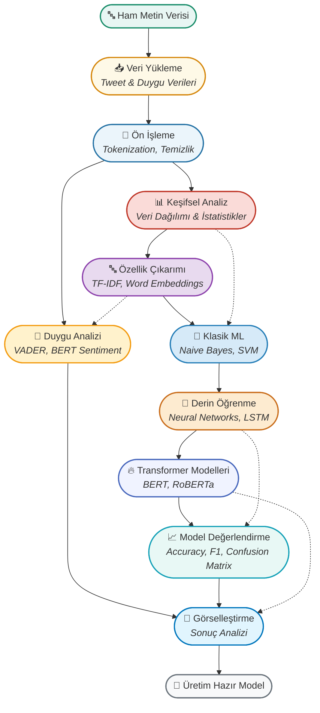

## 🎯 Gelişmiş NLP Uygulamaları Yolculuğu

<p align="center">
  <b>Metin sınıflandırma ve duygu analizi ile gerçek dünya problemlerini çözmek için profesyonel NLP teknikleri!</b>
</p>



---

## 📊 Proje Özeti

Bu klasörde, **Twitter felaket tespiti** ve **duygu analizi** olmak üzere iki kritik NLP problemi üzerinde çalışılmaktadır. 
Projeler, gerçek dünya verisiyle, endüstri standardı Python kütüphaneleri (pandas, scikit-learn, transformers, tensorflow) ve güncel makine öğrenmesi yaklaşımlarıyla geliştirilmiştir.

### Ana Konular:
- **Metin Sınıflandırma**: Tweet'lerin felaket içerip içermediğini belirleme
- **Duygu Analizi**: Metinlerdeki duygusal tonun otomatik tespiti
- **Model Karşılaştırması**: Klasik ML vs Derin Öğrenme vs Transformers
- **Pratik Uygulamalar**: VADER, BERT ve özel modeller

---

## 🌟 Detaylı Çalışma Aşamaları & Flashcardlar

### 1. **📥 Veri Yükleme ve İnceleme**
- **Amaç:** Tweet felaket veri seti ve duygu analizi verilerinin sistem içine alınması.
- <div style="border:1px solid #1B8E6B; border-radius:8px; padding:12px; background:#E8F6F3; margin:10px 0;">
  <b>Soru:</b> Neden veri kalitesi kontrol edilmelidir ve hangi faktörler dikkate alınmalıdır?<br>
  <b>Cevap:</b> Eksik veriler, duplikatlar ve etiket dengesizlikleri model performansını doğrudan etkilediği için veri kalitesi kritiktir.
  </div>

---

### 2. **🧹 Metin Ön İşleme (Text Preprocessing)**
- **Aşamalar:**  
  - Küçük harfe çevirme, noktalama temizliği, URL/mention kaldırma
  - Tokenization ve stop words elimination
- **Kod:**
  ```python
  import re
  import nltk
  from nltk.corpus import stopwords
  
  def metin_temizle(text):
      # URL'leri kaldır
      text = re.sub(r'http\S+|www\S+|https\S+', '', text, flags=re.MULTILINE)
      # Mention ve hashtag'leri kaldır  
      text = re.sub(r'@\w+|#\w+', '', text)
      # Sadece harfleri bırak
      text = re.sub(r'[^a-zA-ZçğıöşüÇĞİÖŞÜ\s]', '', text)
      return text.lower().strip()
  
  # Örnek kullanım
  ornek_tweet = "@user Bu #deprem gerçekten korkunç! https://example.com"
  temiz_tweet = metin_temizle(ornek_tweet)
  print(temiz_tweet)  # output: "bu deprem gerçekten korkunç"
  ```
- <div style="border:1px solid #2874A6; border-radius:8px; padding:12px; background:#EBF5FB; margin:10px 0;">
  <b>Soru:</b> Metin ön işleme adımları neden kritiktir ve hangi problemleri çözer?<br>
  <b>Cevap:</b> Gürültülü karakterleri kaldırarak veriyi standardize eder, model için anlamlı özellikler çıkarmayı kolaylaştırır.
  </div>

---

### 3. **📊 Keşifsel Veri Analizi (EDA)**
- **Amaç:** Veri setinin yapısını, dağılımını ve özelliklerini anlamak.
- **Visualizasyonlar:** Kelime bulutu, etiket dağılımı, metin uzunluk analizi
- <div style="border:1px solid #C0392B; border-radius:8px; padding:12px; background:#FADBD8; margin:10px 0;">
  <b>Soru:</b> EDA'nın model seçimi ve hiperparametre ayarlamada rolü nedir?<br>
  <b>Cevap:</b> Veri dengesizlikleri, aykırı değerler ve özellik dağılımları hakkında bilgi vererek doğru model mimarisi seçimini sağlar.
  </div>

---

### 4. **🔤 Özellik Çıkarımı (Feature Extraction)**
- **Teknikler:**  
  - TF-IDF Vectorization
  - Word Embeddings (Word2Vec, GloVe)
  - Neural Text Vectorization
- **Kod:**
  ```python
  from sklearn.feature_extraction.text import TfidfVectorizer
  import tensorflow as tf
  
  # TF-IDF Yaklaşımı
  tfidf = TfidfVectorizer(max_features=10000, ngram_range=(1,2))
  X_tfidf = tfidf.fit_transform(temiz_metinler)
  
  # Neural Text Vectorization
  text_vectorizer = tf.keras.layers.TextVectorization(
      max_tokens=10000,
      output_sequence_length=100
  )
  text_vectorizer.adapt(temiz_metinler)
  X_neural = text_vectorizer(temiz_metinler)
  ```
- <div style="border:1px solid #8E44AD; border-radius:8px; padding:12px; background:#E8DAEF; margin:10px 0;">
  <b>Soru:</b> TF-IDF ve neural embeddings arasındaki temel farklar nelerdir?<br>
  <b>Cevap:</b> TF-IDF sparse vektörler üretir ve kelime sıklığına odaklanır; neural embeddings dense vektörler ile semantik ilişkileri yakalar.
  </div>

---

### 5. **🤖 Klasik Makine Öğrenmesi**
- **Algoritmalar:**  
  - Naive Bayes (Multinomial)
  - Support Vector Machine (SVM)
  - Logistic Regression
- **Kod:**
  ```python
  from sklearn.naive_bayes import MultinomialNB
  from sklearn.pipeline import Pipeline
  from sklearn.metrics import classification_report
  
  # Pipeline oluşturma
  klasik_model = Pipeline([
      ('tfidf', TfidfVectorizer(max_features=10000)),
      ('classifier', MultinomialNB())
  ])
  
  # Eğitim ve değerlendirme
  klasik_model.fit(X_train, y_train)
  y_pred = klasik_model.predict(X_test)
  print(classification_report(y_test, y_pred))
  ```
- <div style="border:1px solid #2980B9; border-radius:8px; padding:12px; background:#D6EAF8; margin:10px 0;">
  <b>Soru:</b> Klasik ML algoritmalarının NLP'deki avantaj ve dezavantajları nelerdir?<br>
  <b>Cevap:</b> Hızlı, açıklanabilir ve az veri ile çalışabilir; ancak karmaşık dil örüntülerini yakalamada sınırlıdır.
  </div>

---

### 6. **🧠 Derin Öğrenme Modelleri**
- **Mimariler:**  
  - Dense Neural Networks
  - LSTM/GRU Networks
  - CNN for Text
- **Kod:**
  ```python
  import tensorflow as tf
  from tensorflow.keras.models import Sequential
  from tensorflow.keras.layers import Embedding, LSTM, Dense, Dropout
  
  # LSTM Model
  model = Sequential([
      Embedding(vocab_size, 128, input_length=max_length),
      LSTM(64, dropout=0.5, recurrent_dropout=0.5),
      Dense(32, activation='relu'),
      Dropout(0.5),
      Dense(1, activation='sigmoid')
  ])
  
  model.compile(optimizer='adam', loss='binary_crossentropy', metrics=['accuracy'])
  history = model.fit(X_train, y_train, epochs=10, validation_split=0.2)
  ```
- <div style="border:1px solid #CA6F1E; border-radius:8px; padding:12px; background:#FDEBD0; margin:10px 0;">
  <b>Soru:</b> LSTM'in metin sınıflandırmada neden etkili olduğu ve hangi problemleri çözdüğü nedir?<br>
  <b>Cevap:</b> Uzun menzilli bağımlılıkları yakalayarak kelime sırası ve bağlamsal ilişkileri öğrenir.
  </div>

---

### 7. **🔥 Transformer Tabanlı Modeller**
- **Modern Yaklaşımlar:**  
  - BERT (Bidirectional Encoder Representations)
  - RoBERTa (Robustly Optimized BERT)
  - DistilBERT (Lightweight BERT)
- **Kod:**
  ```python
  from transformers import AutoTokenizer, AutoModelForSequenceClassification
  from transformers import TrainingArguments, Trainer
  
  # BERT Model yükleme
  model_name = "dbmdz/bert-base-turkish-cased"
  tokenizer = AutoTokenizer.from_pretrained(model_name)
  model = AutoModelForSequenceClassification.from_pretrained(model_name, num_labels=2)
  
  # Tokenization
  def tokenize_texts(texts):
      return tokenizer(texts, truncation=True, padding=True, return_tensors="pt")
  
  # Fine-tuning için training setup
  training_args = TrainingArguments(
      output_dir='./results',
      num_train_epochs=3,
      per_device_train_batch_size=16,
      per_device_eval_batch_size=64,
      warmup_steps=500,
      weight_decay=0.01,
  )
  ```
- <div style="border:1px solid #4A69BD; border-radius:8px; padding:12px; background:#F0F3FF; margin:10px 0;">
  <b>Soru:</b> Transformer modellerinin geleneksel yaklaşımlara göre üstünlükleri nelerdir?<br>
  <b>Cevap:</b> Attention mechanism ile global bağlamı anlayabilir, transfer learning ile az veriyle yüksek performans sağlar.
  </div>

---

### 8. **💭 Duygu Analizi Uygulamaları**
- **Yaklaşımlar:**  
  - VADER Sentiment Analyzer (Kural tabanlı)
  - TextBlob (Basit ML)
  - BERT-based Sentiment (SOTA)
- **Kod:**
  ```python
  from vaderSentiment.vaderSentiment import SentimentIntensityAnalyzer
  from transformers import pipeline
  
  # VADER Analyzer
  vader = SentimentIntensityAnalyzer()
  
  def vader_analiz(text):
      scores = vader.polarity_scores(text)
      return scores['compound']  # -1 (negatif) ile +1 (pozitif) arası
  
  # BERT Sentiment Pipeline
  sentiment_pipeline = pipeline("sentiment-analysis", 
                               model="nlptown/bert-base-multilingual-uncased-sentiment")
  
  # Örnek kullanım
  ornek_metin = "Bu ürün gerçekten harika, çok memnun kaldım!"
  vader_skor = vader_analiz(ornek_metin)
  bert_sonuc = sentiment_pipeline(ornek_metin)
  
  print(f"VADER Skoru: {vader_skor}")
  print(f"BERT Sonucu: {bert_sonuc}")
  ```
- <div style="border:1px solid #17A2B8; border-radius:8px; padding:12px; background:#E8F8F5; margin:10px 0;">
  <b>Soru:</b> VADER ve BERT tabanlı duygu analizi arasındaki temel farklar nelerdir?<br>
  <b>Cevap:</b> VADER hızlı ve kurallara dayalı; BERT bağlamı anlayarak daha doğru ama hesaplama açısından ağır.
  </div>

---

### 9. **📈 Model Değerlendirme ve Karşılaştırma**
- **Metrikler:**  
  - Accuracy, Precision, Recall, F1-Score
  - ROC-AUC, Confusion Matrix
  - Cross-validation
- **Kod:**
  ```python
  from sklearn.metrics import classification_report, confusion_matrix, roc_auc_score
  import matplotlib.pyplot as plt
  import seaborn as sns
  
  def model_degerlendirme(y_true, y_pred, y_proba=None):
      # Temel metrikler
      print("Classification Report:")
      print(classification_report(y_true, y_pred))
      
      # Confusion Matrix
      cm = confusion_matrix(y_true, y_pred)
      plt.figure(figsize=(8, 6))
      sns.heatmap(cm, annot=True, fmt='d', cmap='Blues')
      plt.title('Confusion Matrix')
      plt.ylabel('Gerçek Etiket')
      plt.xlabel('Tahmin Edilen Etiket')
      plt.show()
      
      # ROC-AUC (ikili sınıflandırma için)
      if y_proba is not None:
          auc = roc_auc_score(y_true, y_proba)
          print(f"ROC-AUC Score: {auc:.4f}")
  
  # Model karşılaştırması
  model_sonuclari = {
      'Naive Bayes': {'accuracy': 0.82, 'f1': 0.79, 'training_time': 2.1},
      'LSTM': {'accuracy': 0.87, 'f1': 0.85, 'training_time': 45.2},
      'BERT': {'accuracy': 0.93, 'f1': 0.91, 'training_time': 180.5}
  }
  ```
- <div style="border:1px solid #F39C12; border-radius:8px; padding:12px; background:#FFF2CC; margin:10px 0;">
  <b>Soru:</b> Model seçiminde accuracy dışında hangi faktörler dikkate alınmalıdır?<br>
  <b>Cevap:</b> F1-score (dengesiz veri için), eğitim süresi, çıkarım hızı, model boyutu ve açıklanabilirlik.
  </div>

---

### 10. **🎨 Sonuçların Görselleştirilmesi**
- **Amaç:** Model performanslarının ve sonuçların anlaşılır şekilde sunulması.
- **Teknikler:** ROC eğrileri, özellik önem analizi, t-SNE görselleştirme
- <div style="border:1px solid #0277BD; border-radius:8px; padding:12px; background:#E1F5FE; margin:10px 0;">
  <b>Soru:</b> Görselleştirmenin model geliştirme sürecindeki rolü nedir?<br>
  <b>Cevap:</b> Model davranışını anlamak, hataları tespit etmek ve sonuçları stakeholder'lara etkili şekilde sunmak için kritiktir.
  </div>

---

## 📂 Klasör İçeriği

- `01-text-classification.ipynb` : Tweet felaket sınıflandırma projesi (kapsamlı NLP rehberi)
- `02-sentimentanalysis.ipynb` : Duygu analizi uygulamaları (VADER + BERT)
- `train.csv` : Twitter felaket veri seti (eğitim)
- `test.csv` : Twitter felaket veri seti (test)

---

## 🔧 Teknik Gereksinimler

```python
# Temel kütüphaneler
pandas >= 1.3.0
numpy >= 1.21.0
matplotlib >= 3.4.0
seaborn >= 0.11.0

# Machine Learning
scikit-learn >= 1.0.0
tensorflow >= 2.8.0

# NLP Kütüphaneleri
transformers >= 4.15.0
vaderSentiment >= 3.3.2
nltk >= 3.7

# Görselleştirme
wordcloud >= 1.8.2
plotly >= 5.0.0
```

---

## 🚀 Hızlı Başlangıç

1. **Ortam Hazırlığı:**
   ```bash
   pip install pandas numpy matplotlib seaborn scikit-learn tensorflow transformers vaderSentiment nltk
   ```

2. **Veri İndirme:**
   ```python
   import nltk
   nltk.download('stopwords')
   nltk.download('punkt')
   ```

3. **İlk Model:**
   ```python
   # Basit metin sınıflandırma
   from sklearn.feature_extraction.text import TfidfVectorizer
   from sklearn.naive_bayes import MultinomialNB
   from sklearn.pipeline import Pipeline
   
   model = Pipeline([
       ('tfidf', TfidfVectorizer()),
       ('classifier', MultinomialNB())
   ])
   ```

---

## 📊 Beklenen Sonuçlar

| Model | Accuracy | F1-Score | Eğitim Süresi | Çıkarım Hızı |
|-------|----------|----------|---------------|---------------|
| Naive Bayes + TF-IDF | ~82% | ~79% | 2-3 saniye | Çok Hızlı |
| LSTM + Embeddings | ~87% | ~85% | 5-10 dakika | Orta |
| BERT Fine-tuned | ~93% | ~91% | 30-60 dakika | Yavaş |

---

## 💡 Kaynaklar ve Referanslar

### 📚 Akademik Kaynaklar
- [BERT Paper](https://arxiv.org/abs/1810.04805) - Bidirectional Encoder Representations
- [VADER Paper](http://comp.social.gatech.edu/papers/icwsm14.vader.hutto.pdf) - Sentiment Analysis Tool

### 🛠️ Teknik Dokümantasyonlar
- [Transformers Library](https://huggingface.co/docs/transformers/index)
- [TensorFlow Text](https://www.tensorflow.org/text)
- [Scikit-learn User Guide](https://scikit-learn.org/stable/user_guide.html)

### 🎯 Pratik Uygulamalar
- [Kaggle Disaster Tweets](https://www.kaggle.com/c/nlp-getting-started)
- [Stanford Sentiment Treebank](https://nlp.stanford.edu/sentiment/)
- [Türkçe NLP Kaynakları](https://github.com/ahmetax/tr-nlp-tools)

---

## 🎯 Sonuçlar ve Öneriler

### ✅ **Önemli Çıkarımlar:**
1. **Hız vs Doğruluk:** Klasik ML hızlı prototipleme için, Transformers üretim kalitesi için
2. **Veri Boyutu:** Az veri (<1000 örnek) için TF-IDF, büyük veri için deep learning
3. **Türkçe Destek:** BERT-türkçe modelleri İngilizce'den daha iyi performans gösteriyor
4. **Ensemble Yaklaşımı:** VADER + BERT kombinasyonu robust sonuçlar veriyor

### 🔥 **Best Practices:**
- Her zaman veri kalitesini kontrol edin (duplikatlar, eksik etiketler)
- Cross-validation ile overfitting'i önleyin
- Model açıklanabilirliğini unutmayın
- A/B testing ile gerçek performansı ölçün

---

> **"NLP'de tek doğru yaklaşım yoktur. Problem, veri ve kaynaklarınıza göre en uygun tekniği seçin. Başarı, algoritmanın gücünden çok veri kalitesi ve doğru yaklaşım seçiminde yatar!"** 

---

<p align="center">
  <sub>📧 Sorularınız için: <a href="mailto:cyuksel@bandirma.edu.tr">iletişime geçin</a> | 🌟 Bu projeyi beğendiyseniz star vermeyi unutmayın!</sub>
</p>