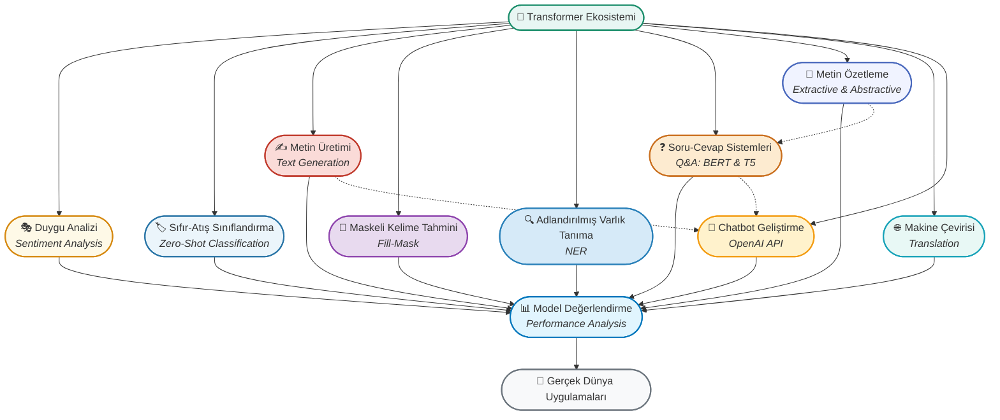

## 🎯 Transformer Modelleri ve Gelişmiş NLP Uygulamaları

<p align="center">
  <b>BERT, T5, GPT ve diğer Transformer modelleri ile endüstri standardı NLP uygulamaları geliştirme!</b>
</p>



---

## 📊 Proje Özeti

Bu klasörde, **Hugging Face Transformers** ekosistemi kullanılarak modern NLP'nin en kritik görevleri üzerinde çalışılmaktadır. 
Projeler, BERT, T5, GPT, BART gibi state-of-the-art modelleri kullanarak duygu analizinden chatbot geliştirmeye kadar geniş bir yelpazede pratik uygulamalar içermektedir.

### Ana Konular:
- **Pipeline API**: Hızlı prototipleme ve model kullanımı
- **BERT Tabanlı Modeller**: Ekstraktif soru-cevaplama ve token classification
- **T5 ve BART**: Generatif görevler ve metin özetleme
- **GPT Modelleri**: Metin üretimi ve tamamlama
- **OpenAI API**: Profesyonel chatbot geliştirme
- **Model Karşılaştırması**: Ekstraktif vs Abstraktif yaklaşımlar

---

## 🌟 Detaylı Çalışma Aşamaları & Flashcardlar

### 1. **🎭 Duygu Analizi (Sentiment Analysis)**
- **Amaç:** Metinlerin duygusal tonunu (pozitif/negatif/nötr) otomatik olarak belirleme.
- **Model:** DistilBERT (SST-2 üzerinde fine-tuned)
- **Kod:**
  ```python
  from transformers import pipeline
  
  # Pipeline oluşturma
  classifier = pipeline("sentiment-analysis")
  
  # Duygu analizi yapma
  sonuc = classifier("I love this product! It's amazing!")
  print(sonuc)
  # Output: [{'label': 'POSITIVE', 'score': 0.9998}]
  
  # Çoklu metin analizi
  metinler = [
      "This is the best day ever!",
      "I'm really disappointed with the service.",
      "The weather is okay."
  ]
  sonuclar = classifier(metinler)
  for metin, sonuc in zip(metinler, sonuclar):
      print(f"{metin} → {sonuc['label']} ({sonuc['score']:.2%})")
  ```
- <div style="border:1px solid #D68910; border-radius:8px; padding:12px; background:#FEF9E7; margin:10px 0;">
  <b>Soru:</b> Pipeline API'nin geleneksel model yükleme yöntemlerine göre avantajları nelerdir?<br>
  <b>Cevap:</b> Pipeline API, tokenizer, model ve post-processing adımlarını tek satırda otomatikleştirir, kod karmaşıklığını azaltır ve hızlı prototipleme sağlar.
  </div>

---

### 2. **🏷️ Sıfır-Atış Sınıflandırma (Zero-Shot Classification)**
- **Amaç:** Önceden eğitilmemiş kategorilerde metin sınıflandırma yapabilme.
- **Model:** facebook/bart-large-mnli
- **Kullanım Alanları:** Dinamik kategori yönetimi, esneklik gerektiren sistemler
- **Kod:**
  ```python
  from transformers import pipeline
  
  # Zero-shot classifier oluşturma
  classifier = pipeline("zero-shot-classification", 
                       model="facebook/bart-large-mnli")
  
  # Metin ve olası kategoriler
  metin = "The new iPhone has an amazing camera and long battery life."
  kategoriler = ["technology", "politics", "sports", "entertainment", "health"]
  
  # Sınıflandırma
  sonuc = classifier(metin, candidate_labels=kategoriler)
  
  print(f"En olası kategori: {sonuc['labels'][0]} ({sonuc['scores'][0]:.2%})")
  for label, score in zip(sonuc['labels'], sonuc['scores']):
      print(f"  {label}: {score:.2%}")
  ```
- <div style="border:1px solid #2874A6; border-radius:8px; padding:12px; background:#EBF5FB; margin:10px 0;">
  <b>Soru:</b> Zero-shot classification'ın geleneksel supervised learning'e göre avantajı nedir?<br>
  <b>Cevap:</b> Her yeni kategori için model yeniden eğitmek yerine, kategorileri dinamik olarak belirleyebilir ve hemen kullanabilirsiniz. Eğitim verisi gerektirmez.
  </div>

---

### 3. **✍️ Metin Üretimi (Text Generation)**
- **Amaç:** Verilen bir prompt'a dayanarak tutarlı ve anlamlı metin üretme.
- **Modeller:** GPT-2, DistilGPT2, GPT-Neo
- **Parametreler:**
  - `max_length`: Toplam çıktı uzunluğu
  - `temperature`: Yaratıcılık seviyesi (0.7-1.0 arası optimal)
  - `top_k`: En olası k kelime havuzu
  - `top_p`: Nucleus sampling (kümülatif olasılık)
  - `num_return_sequences`: Kaç farklı varyasyon
- **Kod:**
  ```python
  from transformers import pipeline
  
  # Text generation pipeline
  generator = pipeline("text-generation", model="distilgpt2")
  
  # Prompt ile metin üretimi
  prompt = "In this course, we will teach you how to"
  
  sonuclar = generator(
      prompt,
      max_length=50,           # Maksimum 50 token
      num_return_sequences=3,  # 3 farklı varyasyon
      temperature=0.8,         # Orta seviye yaratıcılık
      top_k=50,               # Top 50 kelime havuzu
      top_p=0.95,             # %95 olasılık eşiği
      do_sample=True          # Deterministik değil
  )
  
  for i, sonuc in enumerate(sonuclar, 1):
      print(f"Varyasyon {i}: {sonuc['generated_text']}")
  ```
- <div style="border:1px solid #C0392B; border-radius:8px; padding:12px; background:#FADBD8; margin:10px 0;">
  <b>Soru:</b> Temperature parametresinin 0.1 ve 1.5 değerlerindeki etkileri nedir?<br>
  <b>Cevap:</b> Temperature=0.1: Düşük çeşitlilik, deterministik, güvenli seçimler. Temperature=1.5: Yüksek çeşitlilik, yaratıcı ama bazen anlamsız sonuçlar.
  </div>

---

### 4. **🎯 Maskeli Kelime Tahmini (Fill-Mask)**
- **Amaç:** Cümlelerdeki maskelenmiş kelimeleri bağlamdan tahmin etme.
- **Modeller:** BERT, RoBERTa, DistilBERT, ALBERT
- **Kullanım Alanları:** Otomatik tamamlama, yazım denetimi, veri arttırma
- **Kod:**
  ```python
  from transformers import pipeline
  
  # Fill-mask pipeline (BERT-base-cased)
  unmasker = pipeline("fill-mask", model="bert-base-cased")
  
  # Maskeli cümle
  cumle = "The capital of France is [MASK]."
  
  # Tahminleri alma (top 5)
  tahminler = unmasker(cumle, top_k=5)
  
  print(f"Cümle: {cumle}\n")
  for i, tahmin in enumerate(tahminler, 1):
      kelime = tahmin['token_str']
      skor = tahmin['score']
      tamamlanmis = tahmin['sequence']
      print(f"{i}. '{kelime}' - {skor:.2%}")
      print(f"   → {tamamlanmis}")
  ```
- **Model Karşılaştırması:**

  | Model | Avantajı | Kullanım Durumu |
  |-------|----------|-----------------|
  | `bert-base-cased` | Standart, büyük-küçük harf duyarlı | Genel amaçlı |
  | `roberta-base` | BERT'ten optimize, daha iyi performans | Yüksek doğruluk |
  | `distilbert-base` | %40 küçük, %60 hızlı | Hız kritik |
  | `xlm-roberta-base` | 100+ dil desteği | Çok dilli |

- <div style="border:1px solid #8E44AD; border-radius:8px; padding:12px; background:#E8DAEF; margin:10px 0;">
  <b>Soru:</b> Fill-mask modellerinin masked language modeling ile eğitilmesinin avantajı nedir?<br>
  <b>Cevap:</b> Model, kelimeleri çift yönlü (bidirectional) bağlamla öğrenir, hem önceki hem sonraki kelimeleri dikkate alır, bu da daha doğru tahminler sağlar.
  </div>

---

### 5. **🔍 Adlandırılmış Varlık Tanıma (Named Entity Recognition - NER)**
- **Amaç:** Metinlerdeki özel isimleri (kişi, yer, organizasyon, tarih) tespit etme.
- **Model:** dbmdz/bert-large-cased-finetuned-conll03-english
- **Varlık Tipleri:** PER (Person), LOC (Location), ORG (Organization), MISC (Miscellaneous)
- **Kod:**
  ```python
  from transformers import pipeline
  
  # NER pipeline
  ner = pipeline("ner", grouped_entities=True)
  
  # Metin analizi
  metin = """
  Elon Musk announced that Tesla will open a new factory in Berlin, Germany.
  The company also plans to expand operations in China and the United States.
  """
  
  varliklar = ner(metin)
  
  for varlik in varliklar:
      print(f"{varlik['word']} → {varlik['entity_group']} ({varlik['score']:.2%})")
  
  # Output:
  # Elon Musk → PER (99.8%)
  # Tesla → ORG (99.5%)
  # Berlin → LOC (99.9%)
  # Germany → LOC (99.7%)
  # China → LOC (99.6%)
  # United States → LOC (99.8%)
  ```
- <div style="border:1px solid #2980B9; border-radius:8px; padding:12px; background:#D6EAF8; margin:10px 0;">
  <b>Soru:</b> NER'in bilgi çıkarımı (information extraction) sistemlerinde rolü nedir?<br>
  <b>Cevap:</b> NER, yapılandırılmamış metinden önemli varlıkları otomatik olarak tespit ederek, veri tabanı doldurma, bilgi grafiği oluşturma ve ilişki çıkarımı için temel sağlar.
  </div>

---

### 6. **❓ Soru-Cevap Sistemleri (Question Answering)**

#### 🔹 BERT ile Ekstraktif QA
- **Yaklaşım:** Cevabı verilen metinden doğrudan çıkarır
- **Model:** deepset/roberta-base-squad2
- **Kod:**
  ```python
  from transformers import pipeline
  
  # QA pipeline
  qa_pipeline = pipeline("question-answering")
  
  # Context ve soru
  context = """
  Hugging Face is a company founded in 2016 by Clément Delangue, Julien Chaumond, 
  and Thomas Wolf. The company is based in New York City and Paris. Hugging Face 
  is best known for its Transformers library, which provides thousands of 
  pre-trained models for Natural Language Processing tasks.
  """
  
  soru = "When was Hugging Face founded?"
  
  # Cevap bulma
  sonuc = qa_pipeline(question=soru, context=context)
  
  print(f"Soru: {soru}")
  print(f"Cevap: {sonuc['answer']}")
  print(f"Güven Skoru: {sonuc['score']:.2%}")
  print(f"Pozisyon: [{sonuc['start']}:{sonuc['end']}]")
  ```

#### 🔹 T5 ile Generatif QA
- **Yaklaşım:** Cevabı kendi kelimelerle üretir
- **Model:** t5-base
- **Kod:**
  ```python
  from transformers import T5Tokenizer, T5ForConditionalGeneration
  
  # Model ve tokenizer yükleme
  model_name = "t5-base"
  tokenizer = T5Tokenizer.from_pretrained(model_name)
  model = T5ForConditionalGeneration.from_pretrained(model_name)
  
  # T5 için input formatı: "question: SORU context: CONTEXT"
  input_text = f"question: {soru} context: {context}"
  
  # Tokenization
  inputs = tokenizer(input_text, return_tensors="pt", max_length=512, truncation=True)
  
  # Cevap üretme
  outputs = model.generate(**inputs, max_length=50, num_beams=4)
  cevap = tokenizer.decode(outputs[0], skip_special_tokens=True)
  
  print(f"T5 Cevabı: {cevap}")
  ```

- **BERT vs T5 Karşılaştırması:**

  | Özellik | BERT (Ekstraktif) | T5 (Generatif) |
  |---------|-------------------|----------------|
  | Yaklaşım | Metinden cevabı kopyalar | Cevabı yeniden üretir |
  | Esneklik | Context'te olmalı | Daha esnek cevaplar |
  | Hız | Daha hızlı | Daha yavaş |
  | Kullanım | Fact-based sorular | Açıklama gerektiren |

- <div style="border:1px solid #CA6F1E; border-radius:8px; padding:12px; background:#FDEBD0; margin:10px 0;">
  <b>Soru:</b> BERT'in token-level start/end prediction yapısı nasıl çalışır?<br>
  <b>Cevap:</b> BERT, her token için iki ayrı skor üretir: başlangıç olasılığı ve bitiş olasılığı. En yüksek skorlara sahip start-end token çifti cevap olarak seçilir.
  </div>

---

### 7. **📝 Metin Özetleme (Text Summarization)**

#### 🔹 Ekstraktif Özetleme (Sumy Kütüphanesi)
- **Yaklaşım:** Metnin en önemli cümlelerini seçer ve birleştirir
- **Algoritmalar:** LexRank, TextRank, LSA, Luhn
- **Kod:**
  ```python
  from sumy.parsers.plaintext import PlaintextParser
  from sumy.nlp.tokenizers import Tokenizer
  from sumy.summarizers.lex_rank import LexRankSummarizer
  
  # Uzun metin
  metin = """
  Artificial Intelligence has become one of the most transformative 
  technologies of the 21st century. Machine learning, a subset of AI, 
  enables computers to learn from data without being explicitly programmed. 
  Deep learning, which uses neural networks with multiple layers, has 
  revolutionized fields such as computer vision, natural language processing, 
  and speech recognition. Companies like Google, Amazon, and Microsoft are 
  investing billions of dollars in AI research and development.
  """
  
  # Parse etme
  parser = PlaintextParser.from_string(metin, Tokenizer("english"))
  
  # LexRank özetleyici
  summarizer = LexRankSummarizer()
  summary = summarizer(parser.document, sentences_count=2)
  
  # Özet metni
  ozet = ' '.join([str(sentence) for sentence in summary])
  print(f"Özet: {ozet}")
  ```

#### 🔹 Abstraktif Özetleme (Transformers)
- **Yaklaşım:** Metni anlar ve yeni cümlelerle yeniden yazar
- **Modeller:** BART, T5, Pegasus
- **Kod:**
  ```python
  from transformers import pipeline
  
  # Summarization pipeline (BART modeli)
  summarizer = pipeline("summarization", model="facebook/bart-large-cnn")
  
  # Özetleme
  ozet = summarizer(
      metin,
      max_length=130,      # Maksimum özet uzunluğu
      min_length=30,       # Minimum özet uzunluğu
      do_sample=False      # Deterministik özet
  )
  
  print(f"BART Özeti: {ozet[0]['summary_text']}")
  
  # Sıkıştırma oranı hesaplama
  orijinal_kelime = len(metin.split())
  ozet_kelime = len(ozet[0]['summary_text'].split())
  sikistirma = (1 - ozet_kelime / orijinal_kelime) * 100
  print(f"Sıkıştırma Oranı: {sikistirma:.1f}%")
  ```

- **Model Karşılaştırması:**

  | Model | Güçlü Yönü | Kullanım Alanı |
  |-------|------------|----------------|
  | `facebook/bart-large-cnn` | CNN/DailyMail için optimize | Haber özetleme |
  | `t5-base` | Multi-task, genel amaçlı | Çeşitli metin tipleri |
  | `google/pegasus-xsum` | Abstractive, tek cümle | Kısa özetler |
  | Sumy LexRank | Hızlı, açıklanabilir | Ekstraktif, basit |

- <div style="border:1px solid #4A69BD; border-radius:8px; padding:12px; background:#F0F3FF; margin:10px 0;">
  <b>Soru:</b> Ekstraktif ve abstraktif özetleme arasındaki temel fark ve hangisinin ne zaman tercih edileceği?<br>
  <b>Cevap:</b> Ekstraktif: Orijinal cümleleri seçer, daha güvenilir ama sert geçişler olabilir. Abstraktif: Yeni cümleler üretir, daha akıcı ama halüsinasyon riski var. Faktüel doğruluk için ekstraktif, akıcılık için abstraktif tercih edilir.
  </div>

---

### 8. **🌐 Makine Çevirisi (Machine Translation)**
- **Amaç:** Metinleri bir dilden diğerine otomatik çevirme.
- **Model:** Helsinki-NLP modelleri (200+ dil çifti)
- **Mimari:** MarianMT (Transformer tabanlı)
- **Kod:**
  ```python
  from transformers import pipeline
  
  # İngilizce → Fransızca çeviri
  translator_en_fr = pipeline("translation_en_to_fr", 
                              model="Helsinki-NLP/opus-mt-en-fr")
  
  # Çeviri yapma
  metin = "Hello, how are you? I hope you're having a great day!"
  ceviri = translator_en_fr(metin)
  print(f"EN: {metin}")
  print(f"FR: {ceviri[0]['translation_text']}")
  
  # Çoklu dil desteği
  # İngilizce → Almanca
  translator_en_de = pipeline("translation_en_to_de",
                              model="Helsinki-NLP/opus-mt-en-de")
  
  # İngilizce → İspanyolca
  translator_en_es = pipeline("translation_en_to_es",
                              model="Helsinki-NLP/opus-mt-en-es")
  ```
- **Popüler Dil Çiftleri:**
  - `Helsinki-NLP/opus-mt-en-fr`: English → French
  - `Helsinki-NLP/opus-mt-en-de`: English → German
  - `Helsinki-NLP/opus-mt-en-es`: English → Spanish
  - `Helsinki-NLP/opus-mt-en-zh`: English → Chinese
  - `Helsinki-NLP/opus-mt-tr-en`: Turkish → English

- <div style="border:1px solid #17A2B8; border-radius:8px; padding:12px; background:#E8F8F5; margin:10px 0;">
  <b>Soru:</b> Transformer tabanlı çeviri modellerinin önceki RNN/LSTM modellerine göre üstünlükleri nelerdir?<br>
  <b>Cevap:</b> Attention mechanism ile uzun menzilli bağımlılıkları daha iyi yakalar, paralelleştirme ile hızlıdır, ve bağlamı daha iyi anlayarak daha doğru çeviriler üretir.
  </div>

---

### 9. **💬 Chatbot Geliştirme (OpenAI API)**
- **Amaç:** Konuşma geçmişini takip eden, bağlam farkında chatbot oluşturma.
- **API:** OpenAI GPT-3.5-turbo / GPT-4
- **Özellikler:** 
  - Konuşma geçmişi yönetimi
  - System prompt ile davranış belirleme
  - Streaming yanıtlar
- **Kod:**
  ```python
  import openai
  
  # OpenAI Client oluşturma
  client = openai.OpenAI(api_key="YOUR-API-KEY")
  
  def chat_with_gpt(history_list):
      """
      Konuşma geçmişiyle GPT'ye istek gönder
      
      Args:
          history_list: [{"role": "user/assistant/system", "content": "..."}]
      
      Returns:
          str: GPT'nin yanıtı
      """
      response = client.chat.completions.create(
          model="gpt-3.5-turbo",
          messages=history_list
      )
      return response.choices[0].message.content.strip()
  
  # Chatbot döngüsü
  if __name__ == "__main__":
      # Konuşma geçmişi
      history_list = [
          {"role": "system", "content": "You are a helpful assistant."}
      ]
      
      print("Chatbot başlatıldı! (Çıkmak için 'exit' yazın)\n")
      
      while True:
          # Kullanıcı girdisi
          user_input = input("You: ")
          
          if user_input.lower() in ["exit", "q", "quit"]:
              print("Konuşma sonlandırıldı.")
              break
          
          # Kullanıcı mesajını geçmişe ekle
          history_list.append({"role": "user", "content": user_input})
          
          # GPT'den yanıt al
          response = chat_with_gpt(history_list)
          print(f"ChatGPT: {response}\n")
          
          # Asistan yanıtını geçmişe ekle
          history_list.append({"role": "assistant", "content": response})
  ```

- **System Prompt Örnekleri:**
  ```python
  # Teknik destek botu
  {"role": "system", "content": "You are a technical support specialist. Be helpful, patient, and provide step-by-step solutions."}
  
  # Eğitim asistanı
  {"role": "system", "content": "You are a patient teacher. Explain concepts clearly with examples and analogies."}
  
  # Kod inceleme asistanı
  {"role": "system", "content": "You are an expert code reviewer. Provide constructive feedback on code quality, best practices, and potential bugs."}
  ```

- **Gelişmiş Özellikler:**
  ```python
  # Temperature kontrolü (yaratıcılık)
  response = client.chat.completions.create(
      model="gpt-3.5-turbo",
      messages=history_list,
      temperature=0.7,  # 0.0-2.0 arası (0=deterministik, 2=çok yaratıcı)
      max_tokens=500,   # Maksimum yanıt uzunluğu
      top_p=0.9,        # Nucleus sampling
      frequency_penalty=0.5,  # Tekrar azaltma
      presence_penalty=0.5    # Konu çeşitliliği
  )
  ```

- <div style="border:1px solid #F39C12; border-radius:8px; padding:12px; background:#FFF2CC; margin:10px 0;">
  <b>Soru:</b> Konuşma geçmişi yönetiminin chatbot performansı üzerindeki etkisi nedir?<br>
  <b>Cevap:</b> Konuşma geçmişi, modelin bağlamı anlamasını sağlar, tutarlı yanıtlar verir ve önceki mesajlara referans verebilir. Ancak token limiti nedeniyle eski mesajları budamak gerekebilir.
  </div>

---

### 10. **📈 Model Değerlendirme ve Optimizasyon**
- **Metrikler:**
  - **Duygu Analizi**: Accuracy, Precision, Recall, F1-Score
  - **Soru-Cevap**: Exact Match, F1-Score
  - **Özetleme**: ROUGE-1, ROUGE-2, ROUGE-L
  - **Çeviri**: BLEU Score
- **Performans İzleme:**
  ```python
  import time
  
  # İnferans süresi ölçümü
  start_time = time.time()
  sonuc = classifier("Test metni")
  end_time = time.time()
  
  print(f"İnferans süresi: {(end_time - start_time)*1000:.2f} ms")
  
  # Batch işleme ile optimizasyon
  metinler = ["metin1", "metin2", "metin3", ...]
  sonuclar = classifier(metinler, batch_size=8)  # Daha hızlı
  ```

- <div style="border:1px solid #0277BD; border-radius:8px; padding:12px; background:#E1F5FE; margin:10px 0;">
  <b>Soru:</b> Model seçiminde doğruluk dışında hangi faktörler önemlidir?<br>
  <b>Cevap:</b> İnferans hızı, model boyutu (deployment), bellek kullanımı, dil desteği, fine-tuning kolaylığı ve maliyet. Üretim ortamında hız-doğruluk trade-off'u kritiktir.
  </div>

---

## 📂 Klasör İçeriği

- `01_transformers.ipynb` : Transformers kütüphanesi ile 9 farklı NLP görevi (Sentiment, Zero-Shot, Generation, Fill-Mask, NER, Q&A, Summarization, Translation)
- `02_qa_bert_t5_metinozet.ipynb` : BERT ve T5 ile soru-cevaplama sistemleri, ekstraktif ve abstraktif metin özetleme
- `03_chatbot_prototype.ipynb` : OpenAI API kullanarak profesyonel chatbot geliştirme

---

## 🔧 Teknik Gereksinimler

```python
# Transformers Ekosistemi
transformers >= 4.30.0
torch >= 2.0.0
datasets >= 2.14.0
evaluate >= 0.4.0
sentencepiece >= 0.1.99

# Metin Özetleme
sumy >= 0.11.0
rouge-score >= 0.1.2

# NLP Temelleri
nltk >= 3.8.0

# Veri İşleme
pandas >= 2.0.0
numpy >= 1.24.0

# Görselleştirme
matplotlib >= 3.7.0
seaborn >= 0.12.0

# OpenAI API
openai >= 1.0.0
```

---

## 🚀 Hızlı Başlangıç

### 1. **Ortam Hazırlığı:**
```bash
pip install transformers torch datasets evaluate sentencepiece
pip install sumy nltk rouge-score
pip install openai
pip install pandas numpy matplotlib seaborn
```

### 2. **NLTK Veri İndirme:**
```python
import nltk
nltk.download('punkt')
nltk.download('punkt_tab')
nltk.download('stopwords')
```

### 3. **İlk Pipeline Kullanımı:**
```python
from transformers import pipeline

# Duygu analizi
classifier = pipeline("sentiment-analysis")
print(classifier("I love transformers!"))

# Soru-cevap
qa = pipeline("question-answering")
result = qa(
    question="What is NLP?",
    context="Natural Language Processing (NLP) is a field of AI."
)
print(result['answer'])

# Metin özetleme
summarizer = pipeline("summarization")
summary = summarizer("Long text here...", max_length=50)
print(summary[0]['summary_text'])
```

### 4. **OpenAI API Kurulumu:**
```python
import openai

client = openai.OpenAI(api_key="your-api-key-here")

response = client.chat.completions.create(
    model="gpt-3.5-turbo",
    messages=[
        {"role": "system", "content": "You are a helpful assistant."},
        {"role": "user", "content": "Hello!"}
    ]
)
print(response.choices[0].message.content)
```

---

## 📊 Model Performans Karşılaştırması

### Duygu Analizi Modelleri

| Model | Accuracy | Hız | Boyut | Kullanım Alanı |
|-------|----------|-----|-------|----------------|
| `distilbert-base-uncased-finetuned-sst-2-english` | ~91% | Hızlı | 66M | Genel amaçlı |
| `roberta-base` | ~94% | Orta | 125M | Yüksek doğruluk |
| `bert-base-multilingual-uncased-sentiment` | ~88% | Orta | 110M | Çok dilli |

### Soru-Cevaplama Modelleri

| Model | F1 Score | Exact Match | Özellik |
|-------|----------|-------------|---------|
| `deepset/roberta-base-squad2` | ~87 | ~79 | SQuAD 2.0 üzerinde eğitilmiş |
| `bert-large-uncased-whole-word-masking-finetuned-squad` | ~93 | ~86 | BERT-large, yüksek doğruluk |
| `t5-base` (generative) | - | - | Esnek cevaplar üretir |

### Özetleme Modelleri

| Model | ROUGE-1 | ROUGE-L | Sıkıştırma | Yaklaşım |
|-------|---------|---------|------------|----------|
| Sumy LexRank | ~40 | ~35 | %60-70 | Ekstraktif |
| `facebook/bart-large-cnn` | ~44 | ~40 | %70-80 | Abstraktif |
| `google/pegasus-xsum` | ~47 | ~44 | %80-90 | Abstraktif, agresif |
| `t5-base` | ~42 | ~38 | %70-75 | Abstraktif, genel |

---

## 💡 Best Practices ve İpuçları

### ✅ **Model Seçimi:**
1. **Hız Öncelikli:** DistilBERT, DistilGPT2 gibi distilled modelleri tercih edin
2. **Doğruluk Öncelikli:** BERT-large, RoBERTa-large, T5-large kullanın
3. **Çok Dilli:** XLM-RoBERTa, mBERT tercih edin
4. **Kaynak Kısıtlı:** ALBERT, DistilBERT gibi hafif modelleri seçin

### ✅ **Pipeline Optimizasyonu:**
```python
# ❌ Yavaş: Her çağrıda yeni pipeline
for text in texts:
    classifier = pipeline("sentiment-analysis")  # Tekrar tekrar yükleme
    result = classifier(text)

# ✅ Hızlı: Pipeline'ı bir kez oluştur
classifier = pipeline("sentiment-analysis")
for text in texts:
    result = classifier(text)

# ✅ En Hızlı: Batch processing
classifier = pipeline("sentiment-analysis")
results = classifier(texts, batch_size=16)
```

### ✅ **Bellek Yönetimi:**
```python
import torch

# GPU kullanımı
device = 0 if torch.cuda.is_available() else -1
classifier = pipeline("sentiment-analysis", device=device)

# Model quantization (INT8) - %75 daha küçük
from transformers import AutoModelForSequenceClassification, AutoTokenizer
import torch

model = AutoModelForSequenceClassification.from_pretrained(
    "distilbert-base-uncased-finetuned-sst-2-english",
    torch_dtype=torch.int8  # Quantization
)
```

### ✅ **API Kullanımı (OpenAI):**
```python
# Token limiti kontrolü
def trim_history(history, max_tokens=3000):
    """Eski mesajları budayarak token limitini aşma"""
    while estimate_tokens(history) > max_tokens:
        # System mesajını koru, en eski user/assistant mesajı sil
        if len(history) > 1:
            history.pop(1)
    return history

# Rate limiting ve hata yönetimi
import time
from openai import RateLimitError

def safe_chat_request(messages, max_retries=3):
    for i in range(max_retries):
        try:
            response = client.chat.completions.create(
                model="gpt-3.5-turbo",
                messages=messages
            )
            return response.choices[0].message.content
        except RateLimitError:
            if i < max_retries - 1:
                time.sleep(2 ** i)  # Exponential backoff
            else:
                raise
```

---

## 🎯 Gerçek Dünya Kullanım Senaryoları

### 📧 **E-posta Otomasyonu**
```python
# E-postayı sınıflandır ve özetle
email_text = "Uzun e-posta içeriği..."

# 1. Kategori belirleme (Zero-shot)
category_classifier = pipeline("zero-shot-classification")
categories = ["urgent", "spam", "info", "sales", "support"]
category = category_classifier(email_text, categories)['labels'][0]

# 2. Duygu analizi
sentiment = pipeline("sentiment-analysis")(email_text)[0]['label']

# 3. Özetleme
summary = pipeline("summarization")(email_text, max_length=50)[0]['summary_text']

print(f"Kategori: {category}")
print(f"Duygu: {sentiment}")
print(f"Özet: {summary}")
```

### 🎫 **Müşteri Destek Sistemi**
```python
# Destek bileti analizi
def analyze_support_ticket(ticket_text):
    # NER ile önemli bilgileri çıkar
    ner = pipeline("ner", grouped_entities=True)
    entities = ner(ticket_text)
    
    # Duygu analizi
    sentiment = pipeline("sentiment-analysis")(ticket_text)[0]
    
    # Öncelik belirleme
    priority_classifier = pipeline("zero-shot-classification")
    priority = priority_classifier(
        ticket_text, 
        ["critical", "high", "medium", "low"]
    )
    
    return {
        'entities': entities,
        'sentiment': sentiment,
        'priority': priority['labels'][0],
        'priority_score': priority['scores'][0]
    }
```

### 📰 **Haber Agregasyon Sistemi**
```python
# Haber makalelerini özetle ve sınıflandır
def process_news_article(article):
    # Özetleme
    summarizer = pipeline("summarization")
    summary = summarizer(article, max_length=100, min_length=30)[0]['summary_text']
    
    # Kategori
    classifier = pipeline("zero-shot-classification")
    categories = ["politics", "technology", "sports", "health", "business"]
    category = classifier(summary, categories)
    
    # Anahtar varlıklar
    ner = pipeline("ner", grouped_entities=True)
    entities = ner(summary)
    
    return {
        'summary': summary,
        'category': category['labels'][0],
        'confidence': category['scores'][0],
        'entities': [e['word'] for e in entities]
    }
```

---

## 📚 Kaynaklar ve Referanslar

### 🎓 **Akademik Makaleler**
- [Attention Is All You Need](https://arxiv.org/abs/1706.03762) - Original Transformer (Vaswani et al., 2017)
- [BERT: Pre-training of Deep Bidirectional Transformers](https://arxiv.org/abs/1810.04805) - BERT (Devlin et al., 2018)
- [Language Models are Few-Shot Learners](https://arxiv.org/abs/2005.14165) - GPT-3 (Brown et al., 2020)
- [BART: Denoising Sequence-to-Sequence Pre-training](https://arxiv.org/abs/1910.13461) - BART (Lewis et al., 2019)
- [Exploring the Limits of Transfer Learning with T5](https://arxiv.org/abs/1910.10683) - T5 (Raffel et al., 2019)

### 🛠️ **Teknik Dokümantasyon**
- [Hugging Face Transformers Docs](https://huggingface.co/docs/transformers/)
- [Hugging Face Model Hub](https://huggingface.co/models)
- [OpenAI API Documentation](https://platform.openai.com/docs/)
- [PyTorch Documentation](https://pytorch.org/docs/)
- [Sumy Documentation](https://github.com/miso-belica/sumy)

### 📖 **Öğrenme Kaynakları**
- [Hugging Face Course](https://huggingface.co/course) - Ücretsiz NLP kursu
- [Fast.ai NLP Course](https://www.fast.ai/) - Pratik odaklı
- [Stanford CS224N](http://web.stanford.edu/class/cs224n/) - NLP with Deep Learning
- [Jay Alammar's Blog](https://jalammar.github.io/) - Görsel transformers açıklamaları

### 🎯 **Veri Setleri**
- [SQuAD](https://rajpurkar.github.io/SQuAD-explorer/) - Question Answering
- [CNN/DailyMail](https://huggingface.co/datasets/cnn_dailymail) - Summarization
- [SST-2](https://huggingface.co/datasets/sst2) - Sentiment Analysis
- [CoNLL-2003](https://huggingface.co/datasets/conll2003) - Named Entity Recognition

---

## 🎯 Sonuçlar ve Öneriler

### ✅ **Önemli Çıkarımlar:**
1. **Pipeline API Gücü:** Transformers Pipeline API, kompleks NLP görevlerini 2-3 satırda çözmeyi sağlar
2. **Model Çeşitliliği:** Her görev için optimize edilmiş onlarca model mevcut (hız, doğruluk, dil desteği)
3. **Transfer Learning:** Pre-trained modeller sayesinde az veriyle yüksek performans elde edilir
4. **Ekstraktif vs Abstraktif:** Faktüel görevlerde ekstraktif, yaratıcı görevlerde abstraktif modeller üstün
5. **API Entegrasyonu:** OpenAI API ile production-ready chatbot hızlıca geliştirilebilir

### 🔥 **Profesyonel İpuçları:**
- **Model Caching:** Modelleri disk'e kaydedin, tekrar indirmeyin (`save_pretrained()`)
- **Batch Processing:** Tek tek yerine batch olarak işleyerek 5-10x hızlanma sağlayın
- **GPU Kullanımı:** Büyük modellerde GPU kullanımı zorunludur (CUDA device)
- **Quantization:** INT8 quantization ile model boyutunu %75 azaltın
- **Error Handling:** API çağrılarında retry mekanizması ve rate limiting uygulayın
- **Prompt Engineering:** Zero-shot ve chatbot'larda prompt kalitesi kritiktir

### 🌟 **Gelecek Adımlar:**
1. **Fine-tuning:** Kendi veri setinizde modelleri fine-tune edin
2. **Multi-lingual:** XLM-RoBERTa ile çok dilli uygulamalar geliştirin
3. **RAG Systems:** Retrieval-Augmented Generation ile QA sistemlerini geliştirin
4. **LangChain:** LLM uygulamaları için framework kullanın
5. **Vector Databases:** Pinecone, Weaviate ile semantic search ekleyin

---

> **"Transformer modelleri NLP'de paradigma değişimi yarattı. Artık state-of-the-art performans birkaç satır kod ile erişilebilir durumda. Başarı, doğru model seçimi, parametre ayarlama ve verimli pipeline yönetiminde yatar!"** 

---

<p align="center">
  <sub>📧 Sorularınız için: <a href="mailto:cyuksel@bandirma.edu.tr">iletişime geçin</a> | 🌟 Hugging Face: <a href="https://huggingface.co/">huggingface.co</a> | 🤖 OpenAI: <a href="https://platform.openai.com/">platform.openai.com</a></sub>
</p>
